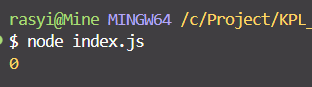

# Tugas Pendahuluan 02: Pemrograman JavaScript
**Soal**

Kamu sudah menulis fungsi mulOfArray. Ujilah dengan input [2, 0, 26, 28, -2], dengan output yang seharusnya adalah 1456. Jika kamu menemukan bahwa hasilnya berbeda, bisakah kamu memperbaikinya? Jika kamu menemukan bahwa hasilnya sama, bisakah kamu menjelaskan mengapa demikian?

**Kode sumber**

Tersedia di [index.js](./index.js)

**Output**



**Deskripsi Program**

Program ini menjalankan perkalian semua bilangan dalam _array_. Ini akan bekerja untuk bilangan positif, nol, dan negatif.

Dengan membuat inisiasi _array_ di awal dengan menggunakan ```const arr = [2,0,26,28,-2]``` 

kemudian dilanjutkan dengan membuat `function mulOfArray` dengan parameter `arr` dari `const arr` pertama di insialisasi terlebih dahulu menggunakan ```let result = 1``` setelah itu kita tambahkan loop dengan menggunakan `for`

```javascript
for (let index = 0; index < arr.length; index++) {
        const element = arr[index];
        if(arr[index] >= 0){
            result = result * arr[index]
        }       
    }
```
Dan kita return value yang telah dioperasikan pada functionnya dengan menggunakan `return result`

Setelah itu kita panggil dengan menggunakan ```console.log(mulOfArray(arr))```

Untuk output, disini kenapa bisa menjadi 0 adalah karena semua bilangan yang dikalikan dengan 0 `maka resultnya adalah 0`. Kecuali jika 0 disini digantikan dengan angka 1, maka resultnya benar `1456`

