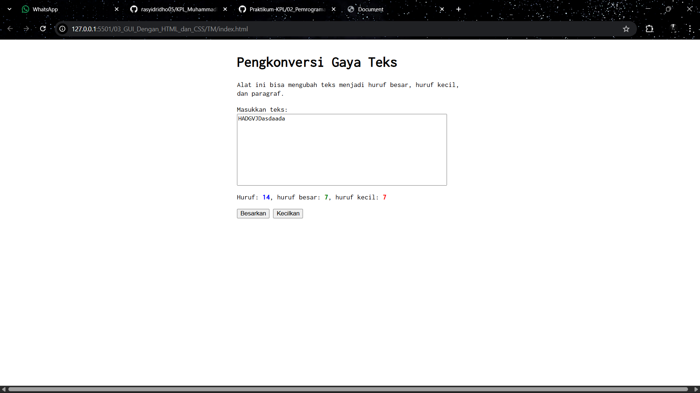

# Tugas Mandiri 03: GUI dengan HTML dan CSS
**Soal**

Pembuatan konversi uppercase dan lowercase pada text area, serta counter huruf nya

**Kode sumber**

Tersedia di [index.html](./index.html) [index.js](./index.js) [style.css](./style.css)

**Output**

**Deskripsi Program**

Program ini menciptakan sebuah tampilan laman untuk Pengonversi Gaya Text, dengan menggunakan html, css dan javascript.

