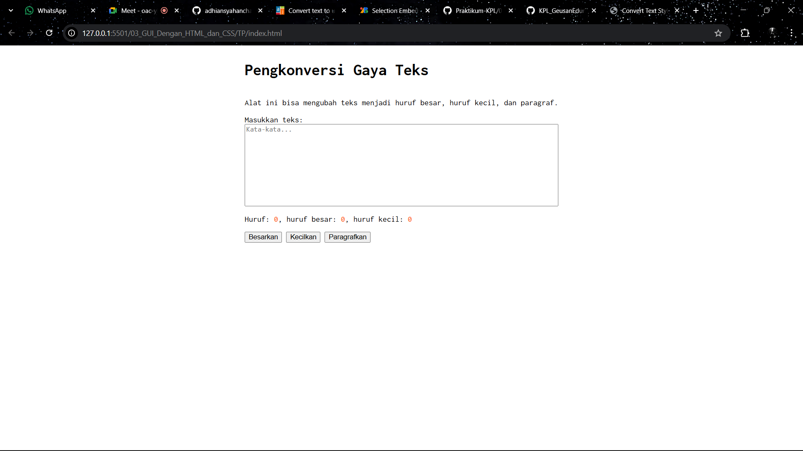

# Tugas Pendahuluan 03: GUI dengan HTML dan CSS
**Soal**

Kamu sudah menulis fungsi mulOfArray. Ujilah dengan input [2, 0, 26, 28, -2], dengan output yang seharusnya adalah 1456. Jika kamu menemukan bahwa hasilnya berbeda, bisakah kamu memperbaikinya? Jika kamu menemukan bahwa hasilnya sama, bisakah kamu menjelaskan mengapa demikian?

**Kode sumber**

Tersedia di [index.html](./index.html) [index.js](./index.js) [style.css](./style.css)

**Output**

**Deskripsi Program**

Program ini menciptakan sebuah tampilan laman untuk Pengonversi Gaya Text, dengan menggunakan html, css dan javascript.

