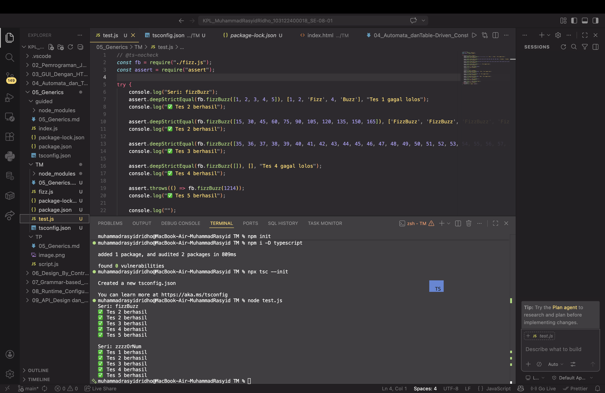

# Tugas Mandiri 05: Generics

**Kode sumber**
Tersedia di [test.js](./test.js) dan [fizz.js](./fizz.js)

**Output**

**Deskripsi Program**

Code ini merupakan implementasi sederhana dari algoritma **FizzBuzz** menggunakan JavaScript dengan pendekatan modular. Terdapat dua fungsi utama yaitu,
- `zzzzOrNum` → untuk memproses satu angka
- `fizzBuzz` → untuk memproses array angka

---

### 1. Fungsi `zzzzOrNum(value)`

Fungsi ini menerima satu buah bilangan bulat dan mengembalikan hasil sesuai dengan menggunakan aturan Fizzbuzz

* Input harus bertipe `number`
* Input harus bilangan bulat (`integer`)
* Jika tidak valid → akan menghasilkan error

---

### 2. Fungsi `fizzBuzz(sequence)`

Fungsi ini menerima sebuah array berisi bilangan bulat, lalu mengembalikan array baru yang telah diproses menggunakan aturan FizzBuzz.

1. Memastikan input adalah array
2. Memastikan semua elemen dalam array adalah bilangan bulat
3. Menggunakan fungsi `zzzzOrNum` untuk memproses setiap elemen

### Pengujian

Pengujian dilakukan menggunakan module `assert` untuk memastikan:

* Output sesuai dengan aturan FizzBuzz
* Error muncul saat input tidak valid