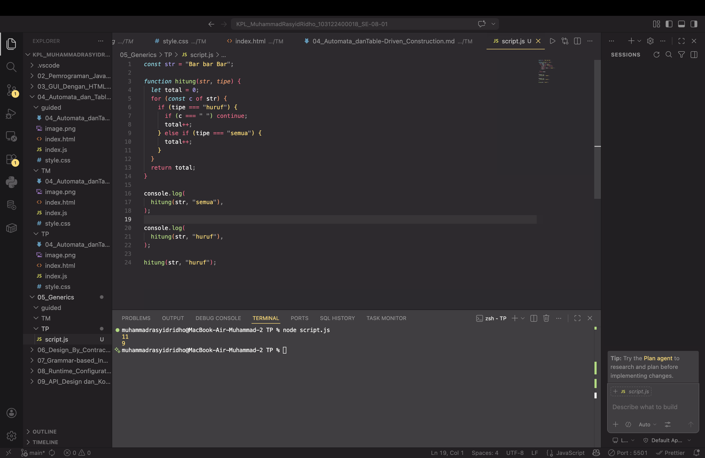

# Tugas Pendahuluan 05: 
**Soal**

Ini adalah kode yang mengurus jumlah semua karakter dan jumlah huruf:

```const str = "Bar bar";

let jumlahSemua = 0;
for (const c of str) { 
    jumlahSemua++; 
}
console.log(total);

let jumlahHuruf = 0;
for (const c of str) { 
    if (c === ' ') continue;
    jumlahHuruf++;
}
console.log(letters);
```

Bagaimana caramu hanya dengan satu fungsi generik bisa mengurus keduanya?
Agar fungsi yang kamu kerjakan benar atau tidak, berikut ini adalah kode tes yang bisa kamu tempelkan:

```
const str = "Bar bar bar";
...
console.log(
   hitung(str, "semua") // Harusnya 11
);

console.log(
  hitung(str, "huruf") // Harusnya 9
);

hitung(str, "huruf"); // Tidak terjadi apa-apa
```

**Kode sumber**

Tersedia di [script.js](./script.js)


**Output**



**Deskripsi Program**

Fungsi hitung(str, tipe) digunakan untuk menghitung jumlah karakter dalam variabel str dengan dua mode perhitungan yang ditentukan oleh parameter tipe:
1. Mode "semua": Menghitung seluruh karakter yang ada di dalam string tanpa terkecuali, termasuk huruf, angka, simbol, dan spasi (karakter kosong).
2. Mode "huruf": Menghitung jumlah karakter namun mengabaikan spasi. Jadi, hanya karakter tampak (seperti huruf atau simbol) yang akan diakumulasikan.

