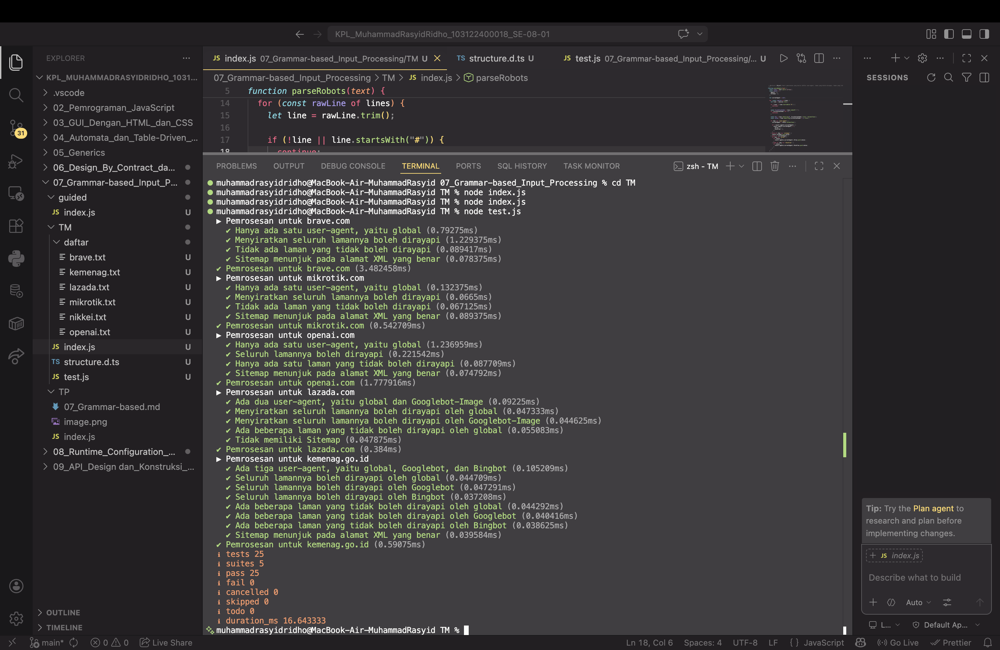

# Tugas Mandiri: Grammar-based Input Processing

## Source Code
Available in [index.js](./index.js) [test.js](./test.js)

## Output

Repositori ini berisi implementasi fungsi Grammar-based Input Processing pakai JavaScript buat menuntaskan tugas Praktikum Konstruksi Perangkat Lunak (KPL) Modul 7.

## Deskripsi 
Di modul ini, fokus utamanya adalah gimana cara kita melakukan _parsing_ atau pengolahan input teks supaya bisa jadi struktur data yang kita mau. Di sini aku bikin fungsi `parseRobots` (sebagai implementasi parser robots.txt) yang tugasnya mengubah teks mentah menjadi objek JavaScript yang terstruktur.

Logika yang aku terapkan di kode ini simpel tapi efektif, ngikutin materi di Modul 7:

1. **Pemisahan Baris:** Memecah string teks panjang menjadi baris-baris menggunakan `.split('\n')` agar bisa diproses secara individual.
2. **State Management:** Menggunakan variabel bantuan untuk melacak `User-agent` yang sedang aktif, sehingga aturan `Allow` dan `Disallow` berikutnya bisa dikelompokkan dengan tepat.
3. **Pembersihan Teks:** Memakai `.trim()` untuk menghapus spasi yang tidak perlu dan melakukan pengecekan `.startsWith('#')` untuk mengabaikan komentar di dalam file.
4. **Transformasi Data:** Mengubah format teks kunci menjadi *lowercase* agar konsisten, namun tetap menjaga struktur properti (seperti `Allow`, `Disallow`, dan `Sitemap`) sesuai dengan kebutuhan pengujian/test case.

Tujuannya supaya program bisa memahami aturan akses bot pada sebuah website secara otomatis tanpa harus membaca teks manual satu per satu.