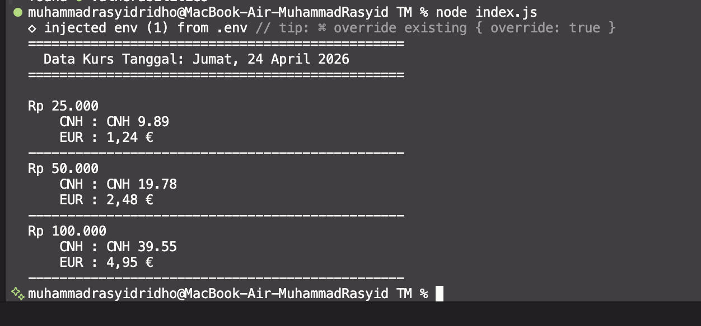

# Tugas Pendahuluan: Runtime Configuration

## Source Code
Available in [index.js](./index.js)

## Output

Pada Tugas Pendahuluan kali ini, fokus utamanya adalah menampilkan waktu saat ini dengan format bahasa Indonesia yang baku menggunakan fitur bawaan JavaScript.

## Deskripsi 
Pada tugas ini, fokus utamanya adalah membuat aplikasi konversi mata uang sederhana yang mengambil data kurs Rupiah (IDR) terhadap Renminbi luar Tiongkok (CNH) dan Euro (EUR) secara real-time melalui API eksternal.

#### Implementasi Intl.NumberFormat
Untuk menghasilkan tampilan nilai mata uang yang profesional seperti "Rp 25.000,00" atau "1,24 €", saya menggunakan Intl.NumberFormat. Hal ini memberikan keunggulan berupa:

Otomatisasi Simbol: Simbol mata uang (Rp, CNH, €) ditempatkan sesuai standar negara masing-masing.

Pemisah Ribuan & Desimal: Mengikuti aturan lokal (misal: penggunaan titik untuk ribuan di Indonesia dan koma di Eropa).

Presisi Desimal: Memastikan tampilan angka tetap konsisten dengan dua angka di belakang koma.

#### Implementasi Intl.DateTimeFormat
Sama halnya dengan mata uang, tanggal pengambilan data diformat menggunakan Intl.DateTimeFormat dengan locale id-ID. Ini mengubah string tanggal mentah dari API (misal: 2026-04-24) menjadi format yang lebih manusiawi seperti "Jumat, 24 April 2026".

##### Konfigurasi Runtime (.env)
Sesuai tantangan, URL API tidak ditulis langsung di dalam kode (hardcoded), melainkan disimpan dalam variabel lingkungan (.env) sebagai BASE_API.

Keamanan & Fleksibilitas: Memungkinkan pengembang mengubah endpoint API tanpa menyentuh logika utama kode.

Dotenv: Menggunakan library dotenv untuk memuat variabel tersebut ke dalam process.env saat aplikasi berjalan.

##### Analisis Alur Program
Program ini menggunakan model pemrograman asinkron (async/await) untuk melakukan fetching data. Setelah data diterima, program melakukan iterasi terhadap nilai uji (Rp25.000, Rp50.000, dan Rp100.000) dan mengalikannya dengan kurs yang didapat sebelum akhirnya ditampilkan ke terminal menggunakan console.log.enggunaan `Intl` dan pola `Date` merupakan bentuk pengenalan aturan (*rules*) dalam penyajian informasi. Kode yang dibuat memastikan bahwa input mentah dari sistem (`new Date()`) diproses sedemikian rupa melalui *formatter* agar menghasilkan output yang sesuai dengan tata bahasa yang diinginkan.