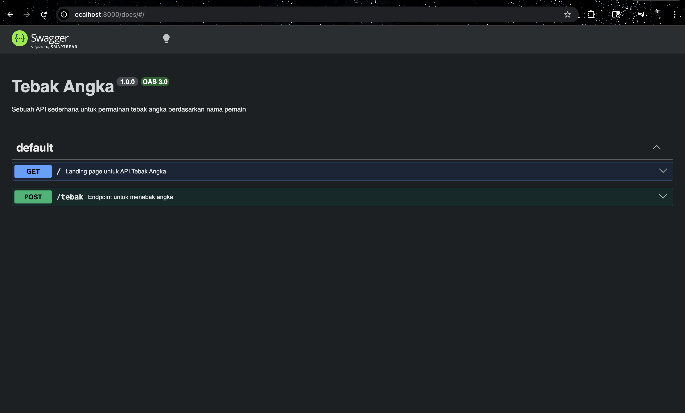
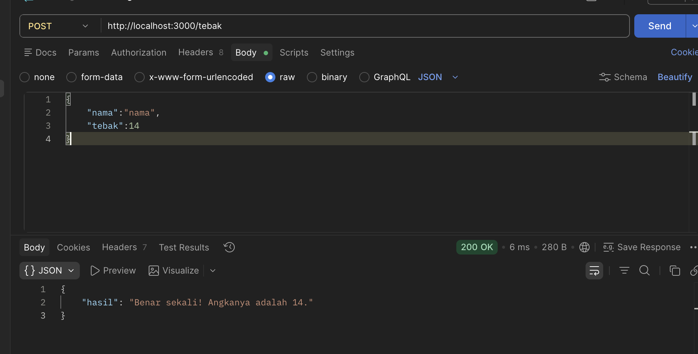

# Tugas Mandiri: API Design 

## Source Code
Available in [index.js](./index.js)
Available in [swagger.js](./swagger.js)

## Output
 dan Output endpoint 

Pada Tugas Mandiri kali ini, fokus utamanya adalah membuat simple API dengan Swagger UI sebagai API Documentationnya, untuk memudahkan frontend developer dalam mengonsumsi API. 

## Deskripsi 
Pada Tugas Mandiri kali ini, fokus utamanya adalah merancang dan mengimplementasikan RESTful API sederhana yang dilengkapi dengan dokumentasi interaktif menggunakan **Swagger UI**. Pembuatan dokumentasi ini bertujuan untuk memberikan kemudahan bagi sisi *client* (seperti *frontend developer*) dalam memahami kontrak API—termasuk struktur *endpoint*, parameter yang dibutuhkan, serta format respons—tanpa harus membaca *source code* backend secara langsung.

Sistem ini dibangun menggunakan lingkungan **Node.js** dengan *framework* **Express.js**. Terdapat beberapa komponen utama dalam implementasi tugas ini:

1. **Implementasi Routing Dinamis**: 
   API memiliki *endpoint* utama yaitu `/menu/{category}` yang memanfaatkan *path parameter* untuk mengambil data spesifik berdasarkan kategori makanan (contoh: `bakmi` atau `rames`). API juga mengimplementasikan penanganan respons dasar, yaitu mengembalikan status `200 OK` beserta data JSON jika kategori ditemukan, dan `404 Not Found` jika data tidak tersedia.

2. **Integrasi Spesifikasi OpenAPI (Modular)**: 
   Pembangunan dokumentasi memanfaatkan *library* `swagger-jsdoc` dan `swagger-ui-express`. Untuk menjaga agar kode tetap bersih dan mudah dikelola (*maintainable*), konfigurasi dasar API (berbasis spesifikasi OpenAPI 3.0.0) dipisahkan secara modular ke dalam file **`swagger.js`**. Sementara itu, detail skema untuk spesifikasi masing-masing *endpoint* tetap dituliskan menggunakan anotasi *block comment* (JSDoc) tepat di atas *route handler* agar selalu sinkron dengan fungsi yang berjalan.

3. **Penyajian Interactive UI**: 
   Antarmuka dokumentasi disajikan melalui *route* `/docs`. Antarmuka visual ini tidak hanya menampilkan rincian API secara statis, tetapi juga menyediakan fitur *Try it out* agar *developer* dapat melakukan *testing request* secara langsung melalui *browser* tanpa memerlukan *tools* API *client* pihak ketiga.