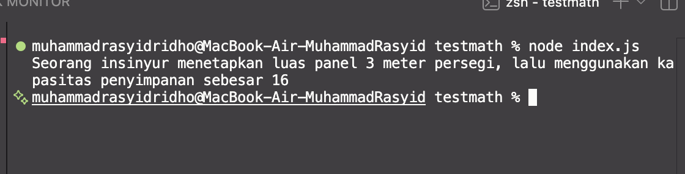

# Tugas Mandiri: Library Construct

## Source Code
* Main Entry Point: [index.js](./testmath/index.js)
* Modul Pangkat: [lib/pangkat.js](./lib/pangkat.js)
* Modul Bulat: [lib/bulat.js](./lib/bulat.js)
* Modul Kuadrat: [lib/kuadrat.js](./lib/kuadrat.js)

## Output

## Deskripsi 
Pada Tugas Mandiri kali ini, fokus utamanya adalah merancang, menstrukturisasi, dan mendistribusikan sebuah *package* Node.js secara lokal. Proyek ini mensimulasikan bagaimana sebuah pustaka bernama `libr` dibuat secara terpusat, lalu diinstal dan digunakan oleh proyek lain (proyek *testing*).

Sistem pustaka ini dibangun dengan mematuhi prinsip **Modularitas** dan **Separation of Concerns**. Terdapat beberapa komponen utama dalam implementasi tugas ini:

1. **Arsitektur Direktori yang Rapi**: 
   Pustaka memisahkan setiap fungsi matematika ke dalam berkas tunggal yang independen di dalam folder `/lib` (yaitu `pangkat.js`, `bulat.js`, dan `kuadrat.js`). Hal ini membuat kode lebih bersih, mudah dibaca, dan mudah dikembangkan (*maintainable*).

2. **Pemusatan Ekspor (Entry Point)**: 
   Meskipun fungsi-fungsi berada di file yang terpisah, proses *export* dikumpulkan dan diarahkan secara terpusat melalui file `index.js` utama. Ini memastikan bahwa *client* atau proyek lain yang menggunakan pustaka ini hanya perlu memanggil dari satu sumber (contoh: `import { kuadrat } from "libr"`), tanpa perlu menelusuri direktori `/lib` masing-masing.

3. **Konfigurasi dan Instalasi Lokal**: 
   Nama pustaka didefinisikan secara eksplisit sebagai `"libr"` melalui properti `name` di dalam `package.json`. Hal ini memungkinkan proyek *testing* di luar folder untuk melakukan instalasi lokal secara absolut (menggunakan perintah `npm install ../nama-folder-pustaka`) dan mengonsumsinya seolah-olah pustaka tersebut diunduh langsung dari repositori *npm*.