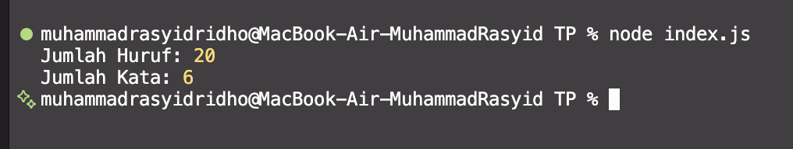

# Tugas Pendahuluan: Library Construct

## Source Code
* Utilitas Pustaka: [textUtils.js](./textUtils.js)
* File Pengujian: [index.js](./index.js)

## Output

## Deskripsi 
Pada Tugas Pendahuluan kali ini, fokus utamanya adalah merancang sebuah pustaka (library) utilitas sederhana menggunakan JavaScript yang berfokus pada manipulasi dan perhitungan data *string*. Pustaka ini dirancang agar bersifat *reusable* (dapat digunakan kembali) dengan menerapkan standar **ES Modules** (ESM).

Terdapat beberapa komponen dan aturan utama dalam implementasi tugas ini:

1. **Fungsi Penghitung Huruf (`hitungHuruf`)**: 
   Fungsi ini bertugas menghitung total karakter alfabet (A-Z dan a-z) di dalam sebuah teks. Implementasinya memanfaatkan *Regular Expression* (Regex) `/[a-zA-Z]/g` untuk memastikan bahwa angka, spasi, dan tanda baca tidak ikut terhitung.

2. **Fungsi Penghitung Kata (`hitungKata`)**: 
   Fungsi ini menghitung jumlah kata dalam sebuah kalimat. Implementasinya melakukan pembersihan spasi di awal dan akhir teks menggunakan `.trim()`, lalu memecah teks berdasarkan spasi tunggal maupun ganda menggunakan Regex `/\s+/`. Hal ini memastikan perhitungan kata tetap akurat meskipun ada kelebihan spasi.

3. **Penerapan ES Modules (ESM)**: 
   Pustaka ini tidak menempatkan eksekusi dan logika dalam satu file yang sama. Fungsi-fungsi utilitas diekspor dari `textUtils.js` dan diimpor ke dalam `index.js` untuk diuji. Konfigurasi `"type": "module"` juga ditambahkan pada `package.json` agar Node.js mengenali sintaks `import` dan `export` standar modern.